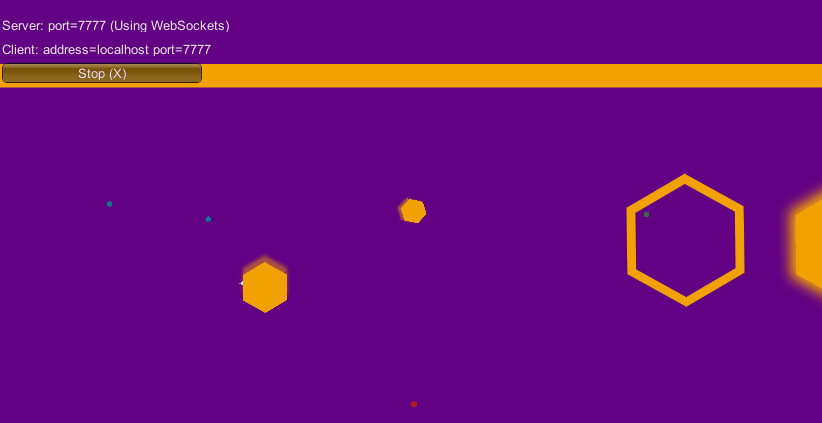

# Bumpa.io
Game where you are a hexagonal spaceship, but the universe is too small to accept others, you have to push (bump) them out.
Both players will have 5 seconds of cooldown after collision and a knockback.
There is only uniform rectilinear trajectories and no friction (like in space).

  - Collision between 2 players
  

  - Collision between a player and a pusher
  

## What does it use?
  - Unity
  - WebGL

## Why this project ?
Wishing to have fun with unity, I tried to make an agar.io-like game with king of opera gameplay.

## How to play?
Your speed increments if you keep pressing SPACE and you're rotation's sense will change each time your release the SPACE key.
  
## To do
- [ ] mass effect on speed
- [ ] win the mass of the player you pushed out of the rectangular area
- [ ] leaderboard

## Can I help you?
Of course ! By hitting the :star: button !
